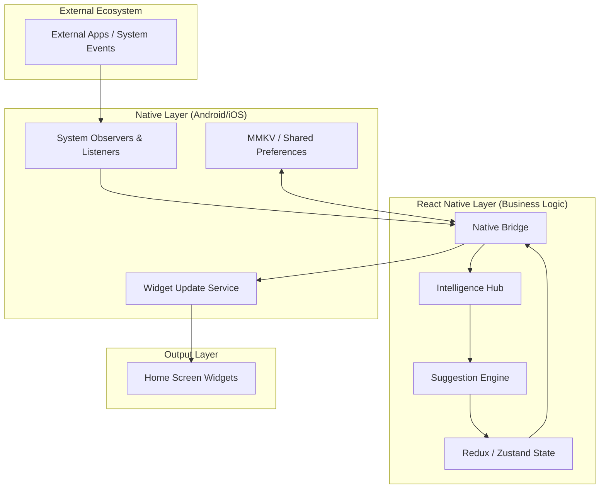

# Cross-App Intelligence Widget System Architecture

This document outlines the architectural blueprint for the Cross-App Intelligence Widget System. The system is designed to aggregate data from multiple applications, process it through an intelligence engine, and deliver context-aware updates to Home Screen widgets on both Android and iOS.

---

## 1. High-Level Architecture

The system follows a **Decoupled Event-Driven Architecture**. It separates data collection, intelligence processing, and UI rendering to ensure low latency and high reliability.

---

## 2. Low-Level Design

### 2.1 Native Host (Native Modules)
- **iOS**: Uses `AppGroup` to share data between the main app and `WidgetExtension`. Implements `NSFileCoordinator` for data integrity.
- **Android**: Uses `AppWidgetManager` and `RemoteViews`. Data is shared via persistent `Store` or `BroadcastIntent`.

### 2.2 Intelligence Hub (JS)
- Acts as the orchestrator. It receives raw signals (e.g., "Calendar event starting in 10 mins", "Unread Slack message from Manager") and normalizes them into a unified `Schema`.

### 2.3 Suggestion Engine
- A priority-based scoring system:
  - **Recency**: How fresh is the data?
  - **Relevance**: Is the user currently in a context where this matters?
  - **Criticality**: Is it a deadline or notification?

---

## 3. Data Flow

1.  **Ingestion**: Native listeners detect system events (Notifications, Location changes, Calendar updates).
2.  **Normalization**: The Bridge serializes native objects into JSON and sends them to the RN layer.
3.  **Processing**: The Suggestion Engine calculates a `PriorityScore` for all active "Intelligence Snippets".
4.  **Distribution**:
    - High-score snippets are sent back to the Native Layer.
    - Native Layer writes to the **Shared Storage** (AppGroup/SharedPrefs).
    - Native Layer triggers a **Widget Refresh**.
5.  **Rendering**: The Widget (SwiftUI `WidgetView` or Android `RemoteViews`) reads from shared storage and updates the UI.

---

## 4. Caching Strategy

The system employs a **Triple-Tier Caching** mechanism:

1.  **L1: Memory Cache (RN Layer)**: Immediate access for the running application.
2.  **L2: Persistent Cache (MMKV)**: Fast, encrypted KV store accessible by RN and Native modules for sub-10ms reads.
3.  **L3: Shared Group Storage**: Specifically for widgets to access data without waking up the full React Native bundle.

---

## 5. Offline Fallback

- **Graceful Degradation**: If the Suggestion Engine cannot reach a remote ML service, it falls back to a **Local Rule-Set (LRS)** pre-computed and stored in MMKV.
- **Stale-While-Revalidate**: Widgets display the last known intelligent state with a "time-since-update" indicator if the data is older than a threshold (e.g., 15 mins).

---

## 6. Permission Handling Strategy

Accessing cross-app data requires sensitive permissions (Accessibility, Notification Access, Calendar, etc.).

- **Phase 1: Transparent Onboarding**: Explaining *why* a permission is needed using "Value-First" screens.
- **Phase 2: Progressive Requesting**: Only asking for Notification access when the user enables the "Messaging Intelligence" widget.
- **Phase 3: Native Checkers**: A dedicated `PermissionModule` that syncs permission states across JS and Native to disable/enable intelligence modules dynamically.

---

## 7. Scalability Considerations

- **Modular Intelligence**: Each "Source" (Calendar, Mail, Slack) is a standalone provider. Adding a new app only requires a new Provider script.
- **Payload Optimization**: Widgets only receive the *computed* display state, not the raw data, minimizing the memory footprint on the native side.
- **Background Task Management**: Uses `WorkManager` (Android) and `BGTaskScheduler` (iOS) to batch intelligence processing, preventing battery drain.

---

## 8. Security

- **Data Sandbox**: No raw cross-app data is transmitted to external servers unless explicitly opted-in for cloud-processing.
- **Encryption**: All cached intelligence snippets are encrypted using system-level keys (KeyChain/KeyStore).
